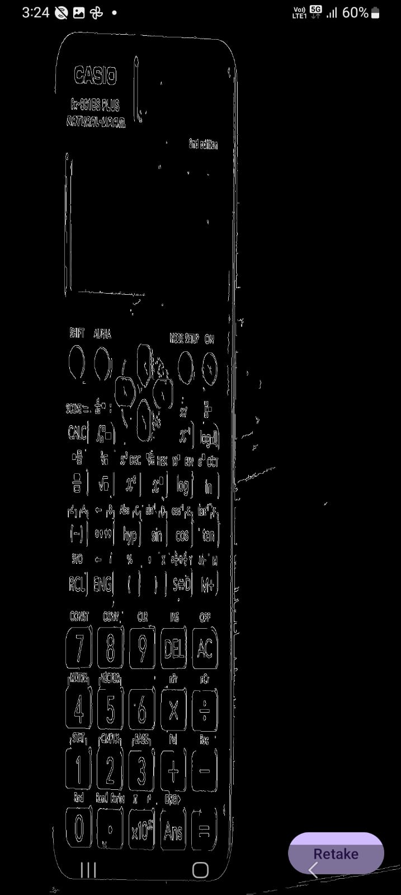

# Edge Viewer App (Android + OpenCV + JNI)

A lightweight Android application that captures an image from the camera and generates an **edge-detected version** using **OpenCV (C++)**, **JNI**, and the **Camera2 API**.

This project demonstrates a complete end-to-end flow:
Camera frame → Bitmap → ByteArray → JNI → OpenCV native processing → Processed output rendering.

---

## 📌 Features

### ✔ Live Camera Preview  
Full-screen real-time camera feed using `TextureView`.

### ✔ Capture Image  
Captures the current frame and converts it into a Bitmap.

### ✔ Native Edge Detection (C++ + OpenCV)  
The captured Bitmap is processed inside a native C++ layer using:
- OpenCV image processing  
- Sobel / Canny edge detection  
- RGBA → Grayscale → Edges → RGBA pipeline

### ✔ Processed Image Display  
Edge-detected output is shown in an ImageView.

### ✔ Retake Function  
Allows returning to live camera mode and capturing again.

---

## 🛠 Tech Stack

### **Android**
- Kotlin  
- Camera2 API  
- TextureView  
- ConstraintLayout  

### **Native Layer**
- C++  
- OpenCV Android SDK  
- JNI (Java Native Interface)  
- CMake  

### **Build Tools**
- Gradle  
- Android Studio  

---

## 📷 How It Works

1. The app launches and initializes the **Camera2 preview** on a `TextureView`.
2. When the user taps **Capture**, the current TextureView frame is converted to a `Bitmap`.
3. The Bitmap is converted into a **ByteArray (RGBA)**.
4. This ByteArray is passed to **native C++ code** through JNI.
5. OpenCV performs:
   - Grayscale conversion  
   - Edge detection (Canny / Sobel filters)  
   - Output formatting back to RGBA  
6. Native code returns the processed ByteArray.
7. Android converts it back to a Bitmap and displays it.
8. The user can tap **Retake** to return to the live camera preview.

---

## 🔬 Native Processing Summary

The JNI function performs:
- ByteArray → `cv::Mat` conversion  
- Grayscale conversion  
- Edge detection using OpenCV  
- `cv::Mat` → ByteArray  
- Returned to Kotlin for display

OpenCV `.so` native libraries are bundled inside the application package.

---

## 📦 Build & Run Guide

### ✔ Run via Android Studio
1. Open the project in Android Studio  
2. Connect an Android device  
3. Press **Run**  
4. The app installs and launches automatically 

### ✔ Install Debug APK
You can generate the debug APK via:
Build → Build APK(s)

You will find the output here:
app/build/outputs/apk/debug/app-debug.apk

## 🧪 Compatibility

- Supports Android 7.0 (API 24) and above  
- ARM architectures supported (arm64-v8a, armeabi-v7a)  
- Designed to run on real devices with Camera2 API support  

---

## 📘 Notes for Reviewer

- This project shows complete native OpenCV integration via JNI.  
- Image is captured from camera, processed entirely in C++, and displayed back in the UI.  
- The Retake feature allows multiple iterations of capture and processing.  
- Debug APK is provided and is fully functional for evaluation purposes.  

---

## 📎 License

This repository is part of a technical assignment submission.  
All code is for demonstration and evaluation purposes only.

---

### Actual Camera Capture

### Edge Detected Output

